  

**Machine learning and backend systems that go into production.**

 

  

---

## Now

Reading for an **MSc in Artificial Intelligence at Nanyang Technological University**, Singapore, through to December 2027. Coursework this semester covers generative models for visual synthesis and deep neural networks for natural language.

Building a **limit order book matching engine** with price time priority, benchmarked on latency percentiles rather than averages. In progress, repo goes public when the benchmark harness is reproducible.

---

## Research

A **visual speech recognition** model reaching **16.06% word error rate** and **5.0% character error rate** on the GRID corpus. Manuscript under review at IET Electronics Letters.

Two patent pending projects, **ROOTED** and **ESG AI**.

A **TEDx** talk on AI driven search.

---

<b>Industry work</b>

 

Built during a software engineering internship at Gulf Business Machines, Dubai. The source is not public.

**VenZone** · vendor lifecycle management platform
Sole developer, around 55,000 lines, 385 automated tests. A ten state workflow engine with capability based access control. Risk and allocation are modelled inside the platform rather than exported to a spreadsheet: logistic regression risk scoring, Monte Carlo value at risk simulation, HHI concentration analysis, and MILP allocation optimization with SciPy. Documents are read offline through RapidOCR and ONNX, a retrieval augmented assistant answers questions against vendor records, and WebSocket collaboration keeps several reviewers on the same file.
`FastAPI` `React` `TypeScript` `SciPy` `ONNX` `WebSockets`

**Revio** · quote extraction inside SAP CPQ
AI powered vendor quote extraction, embedded as a Razor tab so the person pricing a deal never leaves the quote they are working on. A FastAPI backend exposes scan, match and push endpoints, and vendor quotes in PDF and Excel are mapped straight to the fields the target quote requires instead of being normalized generically and reconciled afterwards.
`FastAPI` `Razor` `SAP CPQ` `Python`

**Project Timeline Dashboard** · project tracking, no framework
Around 4,200 lines of plain JavaScript with Upstash Redis handling sync across devices. No framework and no build step.
`JavaScript` `Redis`

<b>Background</b>

 

**Education**
MSc Artificial Intelligence, Nanyang Technological University. Singapore, 2026 to 2027.

**Experience**
Software Engineering Intern, Gulf Business Machines. Dubai, United Arab Emirates.

**Machine learning**
`Sequence models` `Computer vision` `Logistic regression` `Monte Carlo methods` `RAG` `ONNX` `RapidOCR`

**Backend**
`Python` `FastAPI` `WebSockets` `Redis` `SciPy` `REST design`

**Frontend and tooling**
`TypeScript` `React` `JavaScript` `Razor` `SAP CPQ` `Git`

**Also**
British Physics Olympiad merit. Second place, Kyushu Institute of Technology.

---

<picture>
  <source media="(prefers-color-scheme: dark)" srcset="https://raw.githubusercontent.com/athul1810/athul1810/output/snake-dark.svg">
  <source media="(prefers-color-scheme: light)" srcset="https://raw.githubusercontent.com/athul1810/athul1810/output/snake.svg">
  
</picture>

