  

---

## Now

**MSc Artificial Intelligence** at Nanyang Technological University, Singapore, through to December 2027. Deep neural networks for NLP, generative AI for visual synthesis, deep learning and applications.

Building a **limit order book matching engine** with price time priority, benchmarked on latency percentiles rather than averages. Repo goes public when the benchmark harness is reproducible.

---

## Zypit · Founding Engineer

Performance based creator marketing platform, scaled to **65,000 users**, running verified view campaigns for five brands.

Shipped **Obula**, an AI video pipeline turning long form video into short form clips with automated captioning and B roll generation. Over **500 videos** processed for **1,000 users**.

Led a small engineering team, working directly with the founders to turn business requirements into shipped features. Owned delivery end to end across frontend, backend and database.

`React` `Next.js` `TypeScript` `Node.js`

---

## Research

**Visual speech recognition.** A 3D convolutional network with multi head self attention and a bidirectional LSTM, trained end to end with CTC. **16.06% word error rate** and **5.0% character error rate** on the GRID corpus at roughly 23 frames per second, beating recurrent only and transformer baselines trained on identical data.

Sivapatham, S., **Boban, A. K.** and Kar, A. *Multi-Head Self-Attention and Bi-LSTM Based 3D-CNN for Visual Speech Recognition.* Submitted to IET Electronics Letters, under review.

Research Intern at the Centre for Advanced Data Science, VIT Chennai, March 2025 to February 2026.

---

## Projects

**ROOTED** · patent pending
Deep learning plant identification linked to a structured medicinal knowledge graph, with a rule based herb and drug interaction module. Flutter and Firebase.

**ESG AI** · patent pending
ML and NLP pipeline predicting ESG scores from corporate disclosures, with SHAP and LIME attribution and a Streamlit dashboard.

**Diabetic Retinopathy Detection**
SVM and Random Forest baselines against fine tuned ResNet and VGG for severity grading on public retinal benchmarks. 96% accuracy, 0.97 AUC.

---

**Languages**

**Machine learning**

**Backend and data**

**Interfaces**

**Platforms**

---

<b>Industry work at GBM Dubai</b>

 

Software Engineering Intern, Digital and Information Technology, May to July 2026. The source is not public.

**Revio** · AI document extraction embedded in SAP CPQ
Parses unstructured vendor quotes across PDF, XLSX and CSV averaging 30 or more line items into structured quote fields, cutting entry from two or three hours of manual work to under a minute per document, against a monthly volume of roughly 1,000 quotes.

**VenZone** · vendor lifecycle platform, sole developer
55,000 lines. A ten state workflow engine with a visual workflow designer, capability based access control and a retrieval augmented assistant. The quantitative risk layer covers Monte Carlo value at risk, Herfindahl-Hirschman concentration analysis, logistic regression risk scoring and a SciPy mixed integer solver for award allocation. Offline OCR through RapidOCR and ONNX Runtime keeps extraction inside the enterprise network. FastAPI, SQLAlchemy 2.0, PostgreSQL and React 18 with TypeScript, validated against 385 automated tests.

**Team Portal and scheduling dashboard**
Features and functional testing on an internal portal built with Next.js 15, React 19, Prisma and PostgreSQL. A capacity constrained scheduling dashboard in vanilla JavaScript with Upstash Redis sync.

<b>Background</b>

 

**Education**
MSc Artificial Intelligence, Nanyang Technological University. Singapore, 2026 to 2027.
BTech Computer Science and Engineering, AI and ML. Vellore Institute of Technology, Chennai, 2022 to 2026.

**Earlier experience**
AI and ML Intern, Techgentsia Software Technologies, Kochi. Voice change detection in PyTorch, machine vision pipelines in OpenCV, quantization and batch inference for constrained deployment.

**Modeling**
CNNs including ResNet, VGG and EfficientNet, 3D CNNs, Transformers, Vision Transformers, RNNs, LSTMs, GRUs, GANs, autoencoders, multi head self attention, CTC, transfer learning, retrieval augmented generation.

**Quantitative**
Monte Carlo simulation, value at risk, mixed integer linear programming, logistic regression, Herfindahl-Hirschman index, probability, statistical inference, optimization, dimensionality reduction.

**Interpretability**
SHAP, LIME, attention visualisation, gradient based attribution.

**Speaking and awards**
TEDx speaker, *Google: The Immovable Mountain*, on AI driven search. Second place, Kyushu Institute of Technology project competition. Merit certificate, British Physics Olympiad.

**Languages**
English and Malayalam native. Tamil and Indonesian professional. German elementary.

---

<!-- SNAKE: uncomment once the generate snake action has run and the output branch exists

<picture>
  <source media="(prefers-color-scheme: dark)" srcset="https://raw.githubusercontent.com/athul1810/athul1810/output/snake-dark.svg">
  
</picture>
-->

